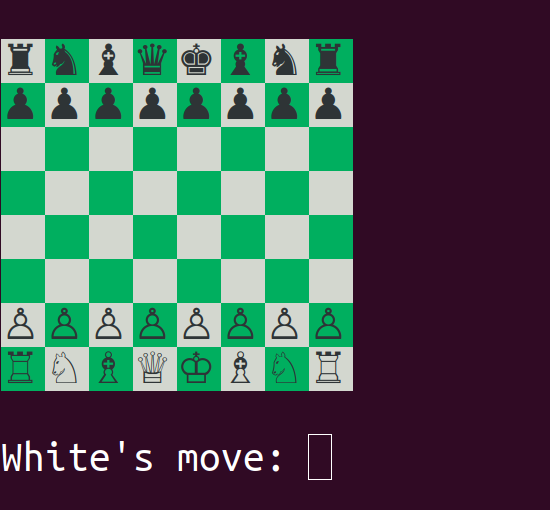
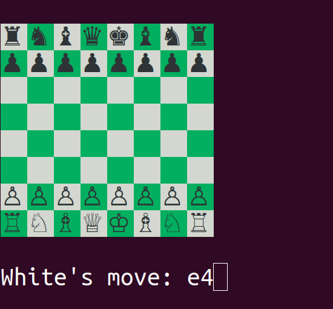
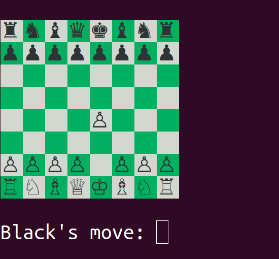

# Command Line Chess

## Ruby Capstone Project - The Odin Project

Usage: `./chess`

### About

Two-player command line chess game. The players control their pieces by typing
in chess notation at the prompt. The game logic was built using TDD.

### Demo

</img>
</img>
</img>
